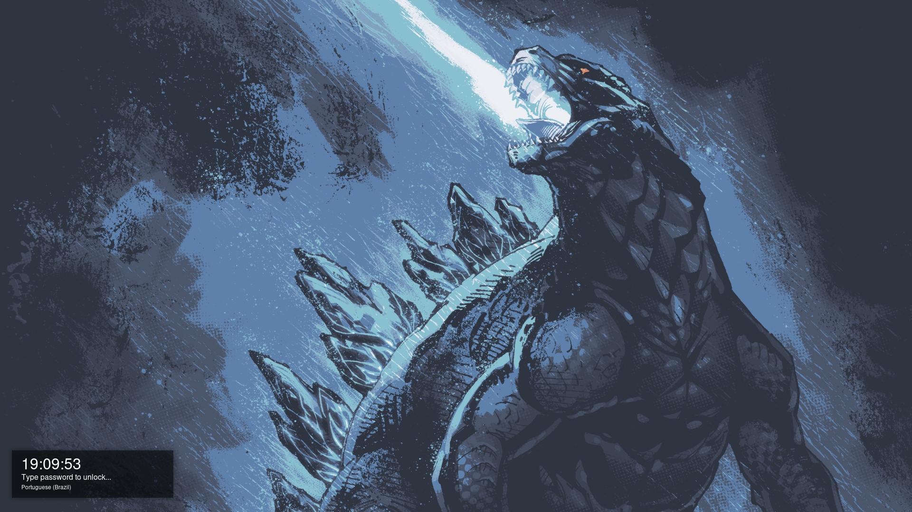
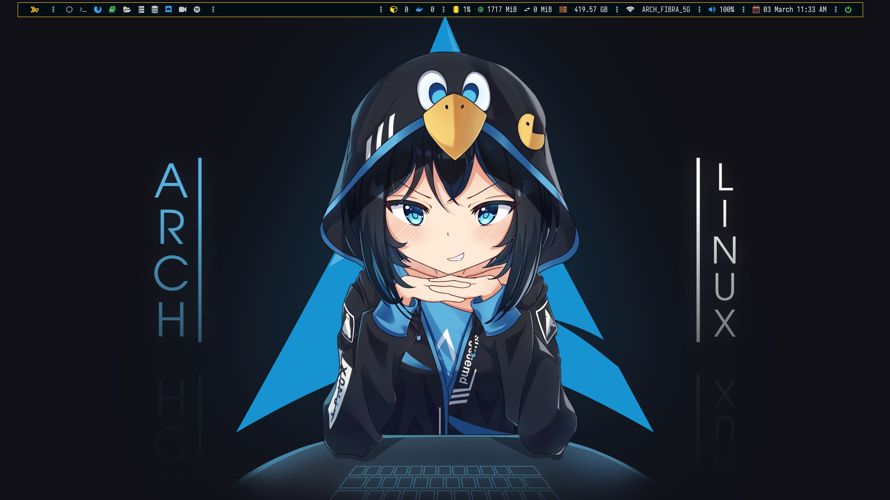
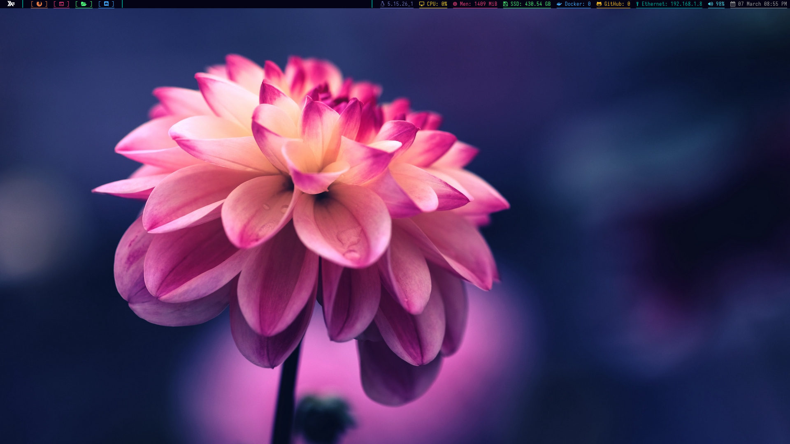

# dotfiles
My dotfiles







# Dependencies
Dependencies will be automatically installed on supported systems. The installation file assumes that you have just installed the operating system and have not installed any extra packages.

+ [bspwm](https://github.com/baskerville/bspwm)
+ sxhkd
+ zsh
+ gcc
+ llvm
+ npm
+ yarn
+ rofi
+ ranger
+ neovim
+ thunar
+ python
+ feh
+ nitrogen
+ wget
+ curl
+ neofetch
+ dunst 
+ picom
+ scrot
+ alacritty
+ yay
+ betterlockscreen
+ polybar
+ consolas-font
+ powerkit

# What will be installed
+ [bspwm](https://github.com/baskerville/bspwm)
+ sudo
+ sxhkd
+ zsh
+ cmake
+ gcc
+ llvm
+ npm
+ yarn
+ rofi
+ ranger
+ neovim
+ thunar
+ python
+ feh
+ nitrogen
+ vscodium
+ wget
+ curl
+ xorg
+ xinit
+ firefox
+ neofetch
+ ninja
+ dunst 
+ picom
+ scrot
+ alacritty
+ yay
+ betterlockscreen
+ polybar
+ consolas-font
+ powerkit

# Installation
Installation script.
```bash
git clone https://github.com/Anderson0xFF/Anderson0xFF
cd dotfiles
./install.sh
```

# Support
+ Arch Linux
+ Void Linux